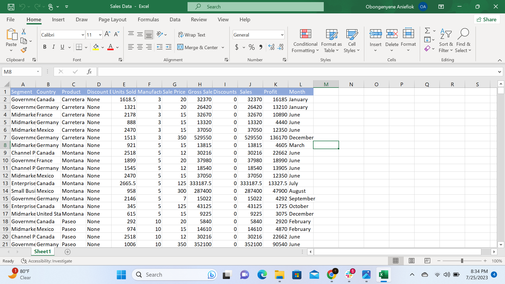

# Task1
## Introduction
After the first class, “DATA ANALYSIS USING EXCEL”, we were given the assignment to create a table containing 20 employee information and perform some basic Excel tasks using the information inputted. This included data on employee ID, Full Name, Department, Salary, and Job Type.

## Tasks
- Show only employees who are ‘Freelancers’ and highlight the ones whose salaries are above $10000
- Split the employees’ full names into first names and last names and check for duplicates and highlight if any.
- Highlight in yellow employees whose names begin with the letter ‘E’. 
- Format the Salary column such that the highest SALARY has a green background and the lowest SALARY has a red background.
  
## Concept Demonstrated
**Data Manipulation/Management by**:
1. Data Filtering/Data Sorting
2. Conditional Formatting
3. Text-to-Column
   
## Raw Data Set

## Task Solutions
For the first task, using the _Filter Function_, I applied a filter on all column headers in the table and sorted out employees who are freelancers. Afterward, I Highlighted the salary column and then used _conditional formatting_ with the _greater than rule_, to highlight freelancers whose salaries are above $10,000 in red. 

  

To split the employees’ full names into first names and last names, I added two new columns to the right titled _First Name_ and _Last Name_ and then used the _text-to-column function_ located in the data tab, specifying space as the delimiter between my data to split the name. After this, I once again used _conditional formatting_ to check for and highlight duplicates.

  

For the last which is highlighting in yellow employees whose names begin with the letter ‘E' and formating the Salary column such that the highest SALARY has a green background and the lowest SALARY has a red background, I first highlighted the name column and using conditional formatting, set a rule to highlight in yellow the names that begging with the letter ‘E’. Then, using the _top/bottom_ rule in conditional formatting, I formatted in green the employees with the highest salary and red, those with the lowest.

  

# Task2
## Introduction
For these task, we were asked to perform **Basic Excel Functions** using a sales data sheet provided by Chinonso that contained the Segment, Country, Product, 	Discount, Units Sold, Manufacturing Price, Sale Price, Gross Sales, Discounts, Sales, Profit, and Month columns.

## Tasks
_**Find:**_
- Total Revenue and Profit generated
- The average Revenue and Units Sold for every order
- The total Discount given in $
- Total number of sales recorded
- The highest Profit generated
- (Create a column named ‘Sales Range’, return ‘High Sales’ if the Sales value is above average, otherwise, return ‘Low Sales’).

## Concept Demonstrated
Use of Basic Excel Functions

## Raw Data Set

## Task Solutions
For the first question, which is finding the total Revenue and Profit generated, I used the **SUM** function to add up all the sales generated by summing the sales data from the first cell to the last on the sales column. i.e =SUM(J2:J701). I did the same for the profit generated. i.e =SUM(K2:K701).

For the second question which is finding the average Revenue and Units Sold for every order, I used the **AVERAGE** function to get the revenue and unit sold averages by inputting the function and then the column range for the revenue and units sold. i.e =AVERAGE(J2:J701), for Revenue and =AVERAGE(K2:K701), for units sold.

To get the total Discount given in $, I used the SUM function, to sum up the discount. I did this by first inputting the **SUM** function after the equal sign, followed by the discount column range. i.e =SUM(I2:I701). Because the question says that the discount that should be given is $, I added the dollar currency to the number from the Home Tab. 

To get the total number of sales recorded, I also used the **COUNT** function followed by the sale column range to give me a count of the number of sales recorded. i.e =COUNT(J2:J701). 

For the highest Profit generated, I used the **MAX** function and inputted the profit column range. This returned the highest profit generated in the sales data. i.e =MAX(K2:K701)

For the task, "create a column named ‘Sales Range’, return ‘High Sales’ if the Sales value is above average, otherwise, return ‘Low Sales’", I first created a column named 'Sales Range', the calculated the average revenue using the **AVERAGE** function. Thereafter, I used the **IF** Function, followed by the sale column range, the logical test which is the average revenue, then the values if true or false to return ‘High Sales’ and ‘Low Sales’ respectively. 

# Task3
## Introduction
For these tasks, we were asked to perform Advance Excel Functions using the same sales data sheet as the one in Task 2.

## Tasks
_**Using the Same Sales Data from Task 2, Find:**_
- The average revenue generated from each sale of ‘Paseo’
- The number of sales made in the Government and Midmarket segment
- The total revenue generated from the sales of ‘Montana’ in Canada
- In which Country, Segment, and Month was the highest unit of goods sold?
- What is the total profit made in December?
  
## Concept Demonstrated
Use of Advance Excel Functions to perform calculations

## Task Solutions
To get the average revenue generated from each sale of ‘Paseo’, I inputted the **AVERAGEIF Function**, then the cell range for the Product column, followed by the constant which in this case is the product, “Paseo” and lastly, the Sales column range. i.e, =AVERAGEIF(C2:C701, "Paseo",J2:J7101)

To get the number of sales made in the Government and Midmarket segments, I used the **SUM** and **COUNTIFS** Functions because we have multiple criteria. With this, I inputted the SUM Function first and this is because I want to get the sum of both Government’, and ‘Midmarket’ Segments. Then followed by the COUNTIFS Function, the Segment Cell Range, and then the Segment constants ‘Government’, and ‘Midmarket’. i.e, =SUM(COUNTIFS($A$2:$A$701,{"Government","Midmarket"})).

To get the total revenue generated from the sales of ‘Montana’ in Canada, I used the **SUMIFS** Function because we are using values from a range based on multiple conditions. I first inputted the sales range after the Function, followed by the Country range, then I put in the first criteria which in this case is the country ‘Canada’, also, the product range, and lastly, the product criteria which is ‘Montana’. i.e, =SUMIFS(J2:J701,B2:B701, "Canada", C2:C701, "Montana") 

For the question, “In which Country, Segment, and Month was the highest unit of goods sold?”, I first got the highest unit of goods sold using the Max Function. Afterward, I got the highest unit sold (Country) using the **VLOOKUP** Function. I inputted the VLOOKUP Function first, followed by the formula I used to get the highest unit i.e, MAX(E2:E701) which serves as the lookup value, then the Country cell range, the column index number, and lastly the range_lookup. i.e, =VLOOKUP(MAX(E2:E701), E2:O701,11, FALSE). I replicated this for the Segment and Month, correct match for the cell range and column index for each of them during the replication. 

For the total profit made in December, I used the **SUMIF** Function because we are working with just a single criterion. I inputted the SUMIF Function, then the cell range for the Month column, followed by the constant which in this case is the Month, “December”, and lastly, the Profit cell range i.e, =SUMIF(L2:L701, "December", K2:K701)

## Conclusion
All tasks from week 1 from data manipulation and management, Basic Excel Functions, and Advance Excel Functions were interesting to work on. And the entire learning process so far has been very impactful.
